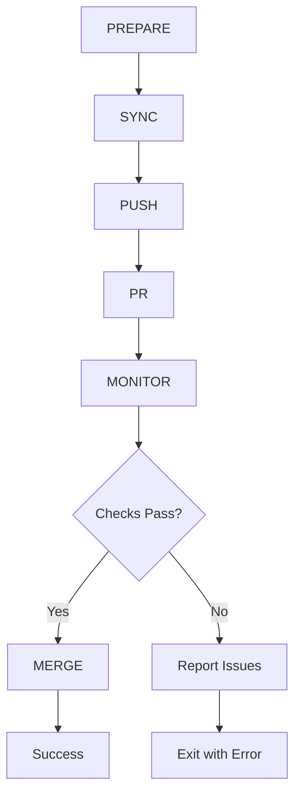

# GitHub Workflow Implementation

Technical implementation details for the github-workflow skill.

## Architecture

The workflow consists of 6 phases executed sequentially:



## Phase Details

### Phase 1: PREPARE

**Responsibilities:**
- Validate git repository
- Detect or generate branch name
- Switch to feature branch if on main/master
- Generate commit message if not provided

**Branch Naming Convention:**
```
<type>-<description>-<timestamp>
```

Example: `feat-add-login-1712217600`

**Logic:**
```bash
if on main/master:
    if has_changes:
        create_feature_branch()
    else:
        exit "No changes to push"
else:
    use_current_branch()
```

### Phase 2: SYNC

**Responsibilities:**
- Fetch from origin
- Check if behind base branch
- Auto-rebase if enabled
- Handle merge conflicts

**Rebase Strategy:**
1. Create temp branch from current HEAD
2. Attempt rebase on temp branch
3. If successful, rebase actual branch
4. If conflicts, abort and report

**Conflict Detection:**
```bash
# Create temporary test branch
git branch temp-branch HEAD
git rebase origin/main temp-branch

if [ $? -ne 0 ]; then
    # Would have conflicts
    git rebase --abort
    exit with error
fi
```

### Phase 3: PUSH

**Responsibilities:**
- Stage changes (if any)
- Create commit with conventional format
- Push to origin
- Set upstream tracking
- Verify push succeeded (SHA comparison)

**Commit Message Format:**
```
type(scope): Brief description

Extended description (optional)
```

**Auto-detected Types:**
- `feat` - New features
- `fix` - Bug fixes
- `docs` - Documentation
- `refactor` - Code restructuring
- `test` - Test additions
- `ci` - CI/CD changes
- `chore` - Maintenance

### Phase 4: PR

**Responsibilities:**
- Check for existing PR
- Create PR if none exists
- Update PR title if changed
- Generate comprehensive PR body

**PR Body Template:**
```markdown
## Summary
<commit message>

## Changes
- <commit 1>
- <commit 2>
...

## Workflow
- Branch: `branch-name`
- Base: `main`
- Auto-merge: true/false
- Merge method: squash/merge/rebase

## Checklist
- [x] Changes pushed
- [x] PR created
- [ ] Checks passing
- [ ] Ready for review
```

### Phase 5: MONITOR

**Responsibilities:**
- Poll GitHub Actions workflows
- Monitor PR checks
- Check repository-wide Actions
- Distinguish pre-existing vs new issues
- Detect warnings (configurable)
- Handle timeouts

**Monitoring Sources:**
1. PR Checks (`gh pr checks`)
2. Repository Actions (`gh run list`)
3. Workflow runs for branch
4. Individual job statuses

**Pre-existing Issue Detection:**

The skill attempts to identify whether failures are:
- **Pre-existing**: Already present in base branch
- **New**: Introduced by current changes

**Algorithm:**
```bash
# 1. Get current PR checks
pr_checks=$(gh pr checks $PR_NUMBER)

# 2. Compare with base branch state
# (This requires checking base branch Actions or comparing with previous run)

# 3. Categorize issues
if issue_in_base_branch; then
    mark_pre_existing()
else
    mark_new()
fi
```

**Polling Strategy:**
```
Poll Interval: 15 seconds
Timeout: 3600 seconds (configurable)
Max Duration: 1 hour default
```

**Status Detection:**
- Pending/Queued/In Progress → Continue polling
- Success/Pass → Check complete
- Failure/Error → Analyze issue type
- Warning → Fail if FAIL_ON_WARNING=1

### Phase 6: MERGE

**Responsibilities:**
- Verify PR is mergeable
- Check merge state status
- Perform merge with configured method
- Handle conflicts
- Cleanup branch (optional)

**Merge Methods:**

| Method | Command | Description |
|--------|---------|-------------|
| Squash | `gh pr merge --squash` | Combine into single commit |
| Merge | `gh pr merge --merge` | Create merge commit |
| Rebase | `gh pr merge --rebase` | Fast-forward after rebase |

**Merge State Check:**
```bash
merge_state=$(gh pr view $PR --json mergeStateStatus --jq '.mergeStateStatus')

# States:
# - CLEAN: Ready to merge
# - BLOCKED: Branch protection
# - BEHIND: Needs update
# - DIRTY: Has conflicts
```

**Pre-merge Verification:**
1. PR is OPEN
2. All required checks passed (or pre-existing only)
3. No conflicts with base
4. Branch protection satisfied

## Error Handling

### Rollback Strategy

| Phase Failed | Rollback Actions |
|--------------|------------------|
| PREPARE | None |
| SYNC | None (manual rebase needed) |
| PUSH | None (commit remains local) |
| PR | Close PR if created |
| MONITOR | Report issues, don't rollback |
| MERGE | None (PR remains open) |

### Exit Codes

| Code | Meaning | Action |
|------|---------|--------|
| 0 | Success | Complete |
| 1 | General error | Stop |
| 2 | Push failed | Retry or manual push |
| 3 | PR failed | Manual PR creation |
| 4 | Checks failed | Review and fix issues |
| 5 | Merge failed | Manual merge |
| 6 | Rebase failed | Manual rebase |
| 7 | Timeout | Extend timeout or check |
| 8 | Pre-existing only | Can force merge |

## GitHub CLI Integration

### Required Commands

```bash
# Authentication
gh auth status

# Repository
gh repo view --json url

# Branches
gh api repos/{owner}/{repo}/branches/{branch}

# Pull Requests
gh pr create --title "" --body "" --base main
gh pr list --head branch-name --json number
gh pr view number --json state,mergeStateStatus
gh pr checks number
gh pr merge number --squash

# Actions
gh run list --branch branch-name
gh run view run-id
```

### API Rate Limits

The skill uses `gh` CLI which handles rate limiting automatically. For high-volume usage, consider:
- Increasing poll interval
- Using webhooks instead of polling
- Caching check results

## Configuration

### Environment Variables

| Variable | Default | Description |
|----------|---------|-------------|
| GITHUB_WORKFLOW_TIMEOUT | 3600 | Monitoring timeout (seconds) |
| GITHUB_WORKFLOW_BASE_BRANCH | main | Target branch |
| GITHUB_WORKFLOW_MERGE_METHOD | squash | Merge strategy |
| GITHUB_WORKFLOW_AUTO_MERGE | 1 | Enable auto-merge |
| GITHUB_WORKFLOW_REBASE | 1 | Auto-rebase when behind |
| GITHUB_WORKFLOW_FAIL_ON_WARNING | 1 | Treat warnings as errors |
| GITHUB_WORKFLOW_CHECK_ALL_ACTIONS | 1 | Monitor all Actions |
| GITHUB_WORKFLOW_CLEANUP_BRANCH | 0 | Delete branch after merge |

### Command Line Overrides

All environment variables can be overridden via CLI flags:

```bash
--timeout 1800              # Overrides GITHUB_WORKFLOW_TIMEOUT
--base-branch develop       # Overrides GITHUB_WORKFLOW_BASE_BRANCH
--merge-method merge        # Overrides GITHUB_WORKFLOW_MERGE_METHOD
--no-auto-merge             # Sets GITHUB_WORKFLOW_AUTO_MERGE=0
```

## Pre-existing Issue Detection

### Challenge

Distinguishing new failures from pre-existing ones is complex because:
1. Base branch may have flaky tests
2. Required checks might be temporarily failing
3. Infrastructure issues affect all branches

### Current Implementation

The skill uses a simplified approach:
1. Monitor PR checks continuously
2. If checks pass → Success
3. If checks fail → Report as new issues
4. User can override with `--no-fail-on-warning`

### Future Enhancement

Compare PR checks with base branch checks:
```bash
# Get base branch status
base_checks=$(gh api repos/{owner}/{repo}/commits/{base-sha}/check-runs)

# Get PR checks  
pr_checks=$(gh pr checks $PR_NUMBER --json)

# Compare failed checks
new_failures=$(compare_checks "$base_checks" "$pr_checks")
```

## Performance Considerations

### Polling Optimization

- **Default interval**: 15 seconds
- **Adaptive**: Could increase interval after 5 minutes
- **Early exit**: Detect terminal states quickly

### Parallel Checks

Could parallelize:
- PR checks monitoring
- Repository Actions monitoring
- Merge state checking

### Caching

Cache for duration of workflow:
- Repository info
- Branch protection rules
- Base branch SHA

## Security

### Authentication

Requires `gh` CLI with valid token:
- `repo` scope for private repos
- `workflow` scope for Actions

### Branch Protection

Respects GitHub branch protection:
- Required reviews
- Required status checks
- Required linear history
- Restrictions

### Secrets

No secrets stored in skill:
- Uses `gh` CLI authentication
- Relies on GitHub token
- No credential management

## Testing

See `evals/README.md` for test scenarios.

## Monitoring

### Logs

Structured logging with timestamps:
```
[14:30:15] PHASE 1: PREPARE
[14:30:15] Current branch: main
[14:30:15] Creating feature branch: feat-auth-1712217615
[14:30:16] Created branch successfully
```

### Metrics

Could track:
- Workflow duration
- Success/failure rates
- Phase-specific timing
- Rebase frequency
- Auto-merge success rate

## Troubleshooting

### Common Issues

**"Not a git repository"**
- Ensure you're in a git repo
- Check `git status`

**"GitHub CLI not authenticated"**
- Run `gh auth login`
- Check `gh auth status`

**"Push failed"**
- Check remote: `git remote -v`
- Verify permissions
- Check network

**"PR creation failed"**
- Ensure gh CLI has repo scope
- Check base branch exists
- Verify branch was pushed

**"Checks failed"**
- Review PR in GitHub UI
- Check if issues are pre-existing
- Use `--no-fail-on-warning` if needed

**"Merge failed"**
- Check branch protection rules
- Verify all required checks pass
- Ensure no conflicts

## Future Enhancements

1. **Webhook Mode**: Use GitHub webhooks instead of polling
2. **Slack Integration**: Notify on completion/failure
3. **Metrics Dashboard**: Track workflow statistics
4. **Auto-retry**: Retry failed Actions
5. **Parallel Jobs**: Monitor multiple workflows
6. **JIRA Integration**: Link PRs to tickets
7. **Release Notes**: Auto-generate from PRs
