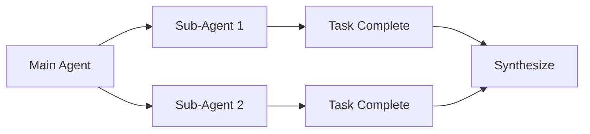

# do-knowledge-studio

> A local-first knowledge management studio — rich notes, knowledge graph, mind maps, full-text search, and AI agent integration in a single browser-based app.

[](https://opensource.org/licenses/MIT)
<!-- AUTO-START:badges -->
[](VERSION)
[](https://react.dev)
[](https://www.typescriptlang.org)
[](https://vitejs.dev)
[](coverage/index.html)
<!-- AUTO-END:badges -->
[](CONTRIBUTING.md)

**Quick Links**: [Quick Start](#-quick-start) · [Features](#-features) · [Architecture](#-architecture) · [AI Agents](#-ai-agent-integration) · [Contributing](#-contributing)

---

## What Is This?

**do-knowledge-studio** is a local-first, offline-capable knowledge management application built with React, TypeScript, and SQLite WASM. It combines a rich-text editor, an interactive knowledge graph, mind mapping, blazing-fast full-text search, and a static site export — all running entirely in the browser with no backend required.

It also ships with a production-ready **AI agent harness** supporting Claude Code, Gemini CLI, OpenCode, Qwen Code, Windsurf, and Cursor — making it a great base for AI-assisted personal knowledge management workflows.

---

## ✨ Features

- **📝 Rich Text Editor** — TipTap-powered WYSIWYG editor with Markdown support and placeholder hints
- **🗄️ Local SQLite Database** — Persistent, offline-first storage via `@sqlite.org/sqlite-wasm` with FTS5 full-text search
- **🔍 Semantic & Full-Text Search** — Orama-powered in-browser search index for fast, context-aware retrieval
- **🕸️ Knowledge Graph** — Interactive node-link graph built with Graphology + Sigma.js; focus mode for deep neighborhood exploration
- **🧠 Mind Maps** — Visual mind mapping with Mind Elixir for brainstorming and concept structuring
- **📤 Static Site Export** — Turn your knowledge base into a shareable, self-contained static site
- **🤖 Multi-Agent AI Harness** — Unified workflow across 6+ AI coding tools with skills, quality gates, and sub-agent patterns
- **🔬 Swarm Analysis** — Parallel AI-powered web research using git worktrees
- **⚡ CLI** — TypeScript CLI for scripting and automation tasks
- **🧪 Full Test Suite** — Vitest unit tests + Playwright end-to-end tests

---

## 🚀 Quick Start

### Prerequisites

- **Node.js** 20+ ([install](https://nodejs.org))
- A modern browser (Chrome, Firefox, Edge)
- *(Optional)* An AI coding CLI: [Claude Code](https://claude.ai/code), [Gemini CLI](https://gemini.google.com), [OpenCode](https://opencode.ai), [Qwen Code](https://github.com/QwenLM/Qwen-Coder)

### Installation

```bash
git clone https://github.com/d-oit/do-knowledge-studio.git
cd do-knowledge-studio
npm install
```

### Development

```bash
npm run dev
```

Open [http://localhost:5173](http://localhost:5173) in your browser.

### Build

```bash
npm run build
npm run preview
```

### Environment

```bash
cp .env.example .env
# Edit .env as needed
```

---

## 🏗️ Architecture

```
src/
├── app/          # React app shell, routing, layout
├── db/           # SQLite WASM database layer + FTS5 search
├── features/     # Feature modules (editor, graph, mindmap, search, export)
├── lib/          # Shared utilities and Orama search index
└── main.tsx      # Entry point

cli/              # TypeScript CLI for automation
export/           # Static site export engine
scripts/          # Setup and quality gate scripts
tests/            # Playwright e2e tests
```

### Tech Stack

| Layer | Technology |
|---|---|
<!-- AUTO-START:tech-stack -->
| UI Framework | React 18 + TypeScript 5 |
| Build Tool | Vite 8 |
| Database | SQLite WASM (FTS5) |
| Search | Orama 3 |
| Rich Text | TipTap 2 |
| Graph | Graphology + Sigma.js |
| Mind Map | Mind Elixir 5 |
| Validation | Zod |
| Icons | Lucide React |
| Unit Tests | Vitest 4 |
| E2E Tests | Playwright |
<!-- AUTO-END:tech-stack -->

---

## 🤖 AI Agent Integration

This project ships with a unified AI agent harness that works across multiple tools:

```
AGENTS.md           # Single source of truth for all agents
├── CLAUDE.md       # Claude Code overrides
├── GEMINI.md       # Gemini CLI overrides
├── QWEN.md         # Qwen Code overrides
└── opencode.json   # OpenCode configuration
```

### Skills System

Reusable knowledge modules live in `.agents/skills/` and are symlinked into each tool's config directory:

```
.agents/skills/         # Canonical skill source
.claude/skills/         # Symlinks → ../../.agents/skills/
.gemini/skills/         # Symlinks → ../../.agents/skills/
.qwen/skills/           # Symlinks → ../../.agents/skills/
```

### Setup Agent Skills

```bash
# Create skill symlinks (run once)
./scripts/setup-skills.sh

# Validate setup
./scripts/validate-skills.sh
```

### Sub-Agent Patterns



---

## 🧪 Testing

```bash
# Unit tests
npm run test

# Watch mode
npm run test:watch

# End-to-end tests
npm run test:e2e

# Type checking
npm run typecheck

# Lint
npm run lint
```

---

## ⚙️ CLI

```bash
npm run cli -- <command>
```

See `cli/` directory for available commands and scripting options.

---

## 📚 Documentation

- 📖 **[AGENTS.md](AGENTS.md)** — AI agent instructions (single source of truth)
- ⚡ **[QUICKSTART.md](QUICKSTART.md)** — 5-minute setup guide
- 🏗️ **[Harness Overview](agents-docs/HARNESS.md)** — Architecture and patterns
- 🪝 **[Skills Guide](agents-docs/SKILLS.md)** — Creating reusable skills
- 🤖 **[Sub-Agents](agents-docs/SUB-AGENTS.md)** — Context isolation patterns
- 🔧 **[Hooks](agents-docs/HOOKS.md)** — Pre/post tool hooks
- 📊 **[Context](agents-docs/CONTEXT.md)** — Back-pressure mechanisms
- ⚙️ **[Configuration](agents-docs/CONFIG.md)** — Repository constants and utilities
- 🔄 **[Migration](agents-docs/MIGRATION.md)** — Adopting in existing projects
- 🔒 **[Security](SECURITY.md)** — Security policy and reporting
- 📝 **[Changelog](CHANGELOG.md)** — Release history

---

## 🤝 Contributing

Contributions are welcome! See [CONTRIBUTING.md](CONTRIBUTING.md) for:

- Development environment setup
- Code style and testing requirements
- Pull request process
- Good first issues

## Community

- 🐛 [Issue Tracker](../../issues) — Report bugs
- 💬 [Discussions](../../discussions) — Ask questions

---

## License

Licensed under the [MIT License](LICENSE).

---

**Local-first. AI-assisted. Built to think.**
