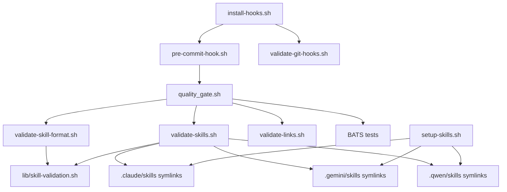

# Scripts Reference

> All scripts in `scripts/` with their purpose, usage, and dependencies.
> Keep this file updated when adding or removing scripts.

## Core Scripts

| Script | Purpose | Usage |
|--------|---------|-------|
| `quality_gate.sh` | Multi-language quality gate (lint, test, format) | `./scripts/quality_gate.sh` |
| `setup-skills.sh` | Create symlinks from `.agents/skills/` to CLI dirs | `./scripts/setup-skills.sh` |
| `pre-commit-hook.sh` | Pre-commit hook template (copied by install-hooks.sh) | Installed via `install-hooks.sh` |
| `install-hooks.sh` | Install git hooks (pre-commit + post-commit) | `./scripts/install-hooks.sh` |

## Validation Scripts

| Script | Purpose | Usage |
|--------|---------|-------|
| `validate-skills.sh` | Validate skill symlinks and SKILL.md files | `./scripts/validate-skills.sh` |
| `validate-skill-format.sh` | Validate SKILL.md frontmatter format | `./scripts/validate-skill-format.sh` |
| `validate-git-hooks.sh` | Check git hooks configuration | `./scripts/validate-git-hooks.sh` |
| `validate-links.sh` | Validate markdown links are not broken | `./scripts/validate-links.sh` |

## Update Scripts

| Script | Purpose | Usage |
|--------|---------|-------|
| `update-agents-md.sh` | Regenerate skill table in AGENTS.md | `./scripts/update-agents-md.sh` |
| `update-agents-registry.sh` | Update AGENTS_REGISTRY.md | `./scripts/update-agents-registry.sh` |
| `generate-available-skills.py` | Auto-generate AVAILABLE_SKILLS.md | `./scripts/generate-available-skills.py` |
| `generate-skills-readme.py` | Auto-generate .agents/skills/README.md | `./scripts/generate-skills-readme.py` |
| `docs-sync.sh` | List changed markdown files (not actual sync) | `./scripts/docs-sync.sh` |

## Advanced Scripts

| Script | Purpose | Usage |
|--------|---------|-------|
| `swarm-worktree-web-research.sh` | Swarm analysis with web research | `./scripts/swarm-worktree-web-research.sh "topic"` |
| `self-fix-loop.sh` | Auto-fix CI failures in a loop | `./scripts/self-fix-loop.sh` |
| `run-evals.py` | Skill evaluation framework | `python3 scripts/run-evals.py` |
| `gh-labels-creator.sh` | Create GitHub labels | `./scripts/gh-labels-creator.sh --ci` |
| `health-check.sh` | Verify environment dependencies | `./scripts/health-check.sh` |
| `minimal_quality_gate.sh` | Fast-path quality gate (CI debug) | `./scripts/minimal_quality_gate.sh` |

## Shared Library

| File | Purpose |
|------|---------|
| `lib/skill-validation.sh` | Shared skill validation functions |
| `lib/worktree-manager.sh` | Git worktree management functions |
| `lib/eval_types.py` | Python eval type definitions |
| `lib/eval_validators.py` | Python eval validation logic |
| `lib/eval_executors.py` | Python eval execution logic |

## Environment Variables

| Variable | Default | Description |
|----------|---------|-------------|
| `SKIP_TESTS` | `false` | Skip BATS test execution |
| `SKIP_LINT` | `false` | Skip linting checks |
| `SKIP_LINKS` | `false` | Skip link validation |
| `SKIP_GLOBAL_HOOKS_CHECK` | `false` | Skip git hooks validation |
| `MAX_SKILL_LINES` | `250` | Max lines per SKILL.md |

## Exit Codes

| Code | Meaning |
|------|---------|
| `0` | Success |
| `1` | Warning / non-critical failure |
| `2` | Critical failure (blocks commit) |

## Dependency Map

