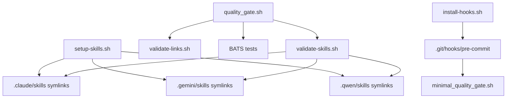

# Scripts Reference

> All scripts in `scripts/` with their purpose, usage, and dependencies.
> Keep this file updated when adding or removing scripts.

## Core Scripts

| Script | Purpose | Usage |
|--------|---------|-------|
| `quality_gate.sh` | Multi-language quality gate (lint, test, format) | `./scripts/quality_gate.sh` |
| `minimal_quality_gate.sh` | Minimal quality gate — lint, typecheck, tests (no build) | `./scripts/minimal_quality_gate.sh` |
| `verify.sh` | Full verification — lint, typecheck, test, build | `./scripts/verify.sh` |
| `verify-deps.sh` | Verify dependency changes don't break the build | `./scripts/verify-deps.sh` |
| `setup-skills.sh` | Create symlinks from `.agents/skills/` to CLI dirs | `./scripts/setup-skills.sh` |
| `install-hooks.sh` | Install git hooks (pre-commit + commit-msg) | `./scripts/install-hooks.sh` |
| `propagate-version.sh` | Sync `VERSION` to derived version strings in docs | `./scripts/propagate-version.sh` |

## Validation Scripts

| Script | Purpose | Usage |
|--------|---------|-------|
| `validate-skills.sh` | Validate skill symlinks and SKILL.md files | `./scripts/validate-skills.sh` |
| `validate-git-hooks.sh` | Check git hooks configuration | `./scripts/validate-git-hooks.sh` |
| `validate-links.sh` | Validate markdown links are not broken | `./scripts/validate-links.sh` |
| `validate-package-manager.sh` | Validate the correct package manager (pnpm) is used | `./scripts/validate-package-manager.sh` |
| `validate-github-actions-shas.sh` | Validate GitHub Actions are pinned to full commit SHAs | `./scripts/validate-github-actions-shas.sh` |

## Automation Scripts

| Script | Purpose | Usage |
|--------|---------|-------|
| `self-fix-loop.sh` | Auto-fix CI failures in a loop | `./scripts/self-fix-loop.sh` |
| `diagnose-merge-state.sh` | Diagnose a BLOCKED pull request merge state | `./scripts/diagnose-merge-state.sh` |
| `docs-sync.sh` | Check documentation consistency (AGENTS.md, agents-docs/, skills) | `./scripts/docs-sync.sh` |
| `audit-vite-env.sh` | Audit environment-variable secret exposure in client bundles | `./scripts/audit-vite-env.sh` |
| `agent-surface.py` | Validate ADR 029 agent surfaces (symlinks, canonical skills) | `python3 scripts/agent-surface.py` |
| `generate-skills-docs.py` | Regenerate skill tables (AVAILABLE_SKILLS.md, skills README) | `python3 scripts/generate-skills-docs.py` |

## Shared Library

| File | Purpose |
|------|---------|
| `lib/lint_cache.sh` | Lint-result caching for the quality gate |
| `lib/run-check.sh` | Shared check runner used by verify.sh |
| `lib/workflow-monitor.sh` | Shared check-state parser used by GitHub workflow skills |

## Environment Variables

| Variable | Default | Description |
|----------|---------|-------------|
| `SKIP_TESTS` | `false` | Skip BATS test execution |
| `SKIP_LINT` | `false` | Skip linting checks |
| `SKIP_CLIPPY` | `false` | Skip clippy lint checks |
| `SKIP_GLOBAL_HOOKS_CHECK` | `false` | Skip git hooks validation |
| `FORCE_COLOR` | auto | Force color output on/off |

## Exit Codes

| Code | Meaning |
|------|---------|
| `0` | Success |
| `1` | Warning / non-critical failure |
| `2` | Critical failure (blocks commit) |

## Dependency Map

```mermaid
graph TD
    A[quality_gate.sh] --> B[validate-skills.sh]
    A --> D[validate-links.sh]
    A --> E[BATS tests]
    G[install-hooks.sh] --> H[.git/hooks/pre-commit]
    H --> M[minimal_quality_gate.sh]
    J[setup-skills.sh] --> K[.claude/skills symlinks]
    J --> L[.gemini/skills symlinks]
    J --> P[.qwen/skills symlinks]
    B --> K
    B --> L
    B --> P
```
